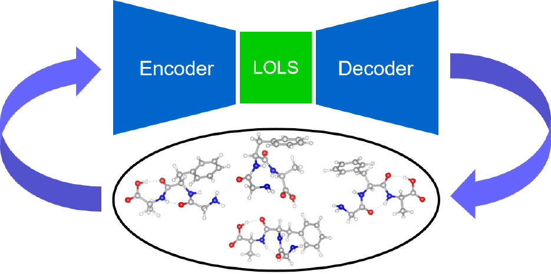

# lols
Low-energy Latent Space Search Workflow. 



## Publication
Our work has been published on **Journal of Chemical Theory and Computation**
 - [Molecular Conformer Search with Low-Energy Latent Space](https://pubs.acs.org/doi/10.1021/acs.jctc.2c00290)

## Tasks
Tasks and their sub-tasks.
- main
  * data_generation
    - train_vae
    - sample
    - dft_energy
  * energy_model
    - gp_model
    - gp_minimum
  * relaxation
    - dft_relax

## Folders and Files
| folder | information |
|:------:|:-----------:|
| lib | read-only files for materials and software configure |
| model | Encapsulation of VAE model and other physical models. |
| task | LOLS tasks |
| work | Isolated folders for all tasks. |

| file | information |
|:----:|:-----------:|
| config.json | Where configurations for all tasks are saved. |
| lols.db | data base, where only the task information are saved. |
| database.py | python modules for operating `lols.db` |
| main.py | entries for the program |

## Run
1. Switch to the python env which have **pytorch** installed.
2. Modify `config.json`
 - see the template file `lib/config/config.json.template`
 - or use `config-test.json`
3. Run `python main.py`

## Restart
Set task's state = 0 or 1 to restart that task:
```bash
sqlite3 lols.db 'update task set state = {new_state} where id = {task_id}'
```

- If the state set to 0, the task will refresh its config before running. 

## Database
table task:
| column | information |
|:------:|:-----------:|
| id | task id, the primary key |
| state | 0: not start, 1: start, 2: finish |
| iteration | number of iteration |
| key | sub index |
| name | name of task, related to task/{name}.py |
| config | config of task, will save in config.json |
